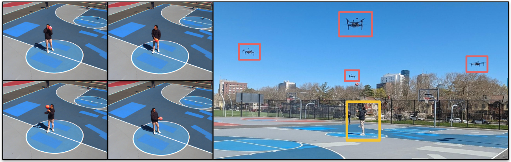

# A System for Multi-View Mapping of Dynamic Scenes Using Time-Synchronized UAVs

This repository contains all the software and hardware design used for our paper - [A System for Multi-View Mapping of Dynamic Scenes Using Time-Synchronized UAVs]. The system is designed to map dynamic scenes using multiple UAVs. The UAVs are equipped with a stereo camera. The system is capable of mapping dynamic scenes in real-time and can be used for applications such as Human Motion Capture in the wild, Sports Analytics, CGI, etc.

## Hardware Setup
We use the following hardware components for our system:
- [Ublox F9T GPS Module](https://www.sparkfun.com/sparkfun-gnss-timing-breakout-zed-f9t-qwiic.html)
- [Multi Band GNSS Antenna](https://www.tme.com/us/en-us/details/ant-ch301/gps-antennas/jc-antenna/jch301-sy301/)
- [BlackFly S BFS-U3-16S2C](https://www.teledynevisionsolutions.com/products/blackfly-s-usb3/?model=BFS-U3-16S2C-CS&vertical=machine%20vision&segment=iis)
- [Nvidia Jetson Orin Nano](https://www.nvidia.com/en-us/autonomous-machines/embedded-systems/jetson-orin/nano-super-developer-kit/)
- [Pixhawk 4 mini](https://holybro.com/products/pixhawk-4)
- [Sync Board]()
- [Mesh Radio](https://www.mouser.com/ProductDetail/Doodle-Labs/RM-2450-12M3?qs=ulEaXIWI0c9IN5TcyFcoeA%3D%3D)
- [Drone Frame]()

## Software Setup
Our software runs on ROS1 and is tested on Ubuntu 20.04. We use the following ROS packages:
- [mavros](https://github.com/mavlink/mavros)
- [mavros_extras](https://wiki.ros.org/mavros_extras)
- [spinnaker_camera_driver](https://github.com/neufieldrobotics/spinnaker_sdk_camera_driver)
- [GPS_driver]()

For 3D and 4D reconstruction, we use the following codebases:
- [COLMAP](https://colmap.github.io/format.html)
- [VGGSFM](https://vggsfm.github.io/)

## Dataset
We provide a dataset of dynamic scenes captured using our system. The raw dataset can be downloaded from [here](https://drive.google.com/drive/folders/1jDzJ7APKrxKKnb07WjBD0iBfiOWMMswl?usp=sharing)
The dataset folder contains the following:
- Rosbag files of the stereo camera and GPS data.
- Calibration files for the stereo camera.

We also provide the processed dataset [here](https://drive.google.com/drive/folders/1jDzJ7APKrxKKnb07WjBD0iBfiOWMMswl?usp=sharing)
The processed dataset contains the following:
- Extracted images, timestamps, and GPS data.
- Small sequences of images for 4D reconstruction. Each sequence contains the following:
    - Rectified stereo images.
    - Stereo disparity maps.
    - Stereo depth maps.
    - Generated 3D point cloud from depth maps.
    - Aligned GPS data.
    - 3D reconstruction using VGGSFM for each timestep.
    - 4D reconstruction using VGGSFM and COLMAP for the sequence.

